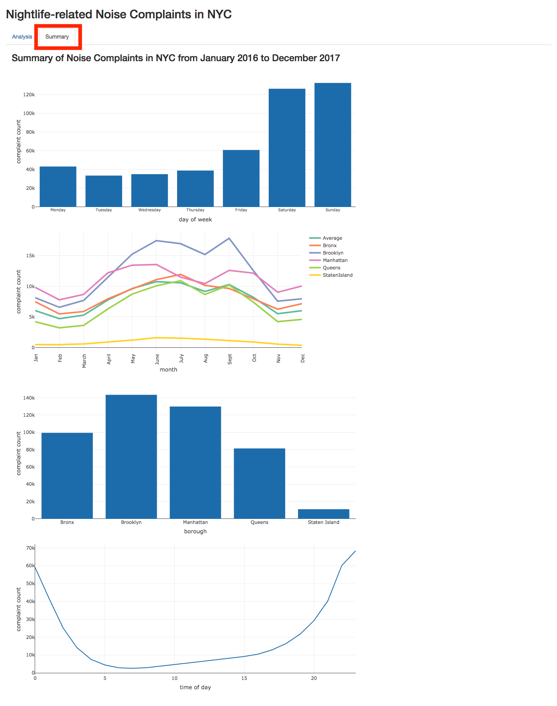
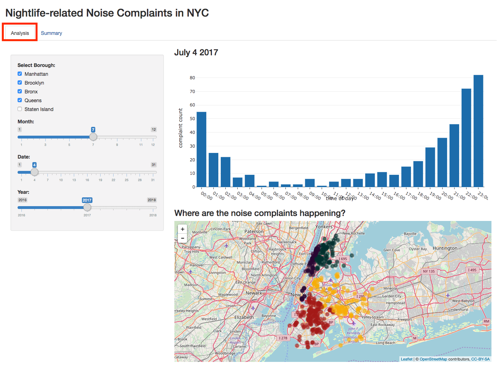

# NYC Noise Complaints 

## Overview

New York City has a booming nightlife scene. With a wide offering of sports bars, dive bars, cocktail dens, and bottle-service-only dance clubs,  there’s a reason why New York is called the "city that never sleeps". However, late-night parties affect residential areas and in some cases, the police get involved with noise complaints. 

In the summer of 2017, Mayor de Blasio signed a bill to create an ["Office of Nightlife"](https://nypost.com/2017/09/19/de-blasios-newest-city-agency-office-of-nightlife/) to promote a vibrant nightlife scene while keeping residential areas safe. I propose an app that visualizes nightlife-related noise complaint acitvity across New York City's boroughs to help the "Office of Nightlife" better understand when and where the nightclubs are affecting city residents. This app will have a heatmap of noise complaint activity that shows exactly where the noise complaints occur the most (and least) over time. 

## Description of the data

I will be using 311* service request data from [NYC OpenData](https://data.cityofnewyork.us/), filtered for type "noise complaints" with descriptor "loud music/party". Due to the large volume of data (over 1 million rows), I will focus specifically on noise complaints in 2016. If the performance of the app isn't severely compromised by adding more data, I will also include data from 2017 and January 2018. 

The key features that I will be looking at are: (1) date of noise complaint, (2) time noise complaint was issued, (3) time noise complaint was resolved, (4) latitude and longitude coordinates where noise complaint was made, and (5) borough (e.g., Manhattan, Queens, Staten Island, Long Island, Bronx). 

* Note: 311 is a non-emergency call center that allows residents to either file complaints or make service requests. 

Dataset can be found at [NYC Open Data](https://data.cityofnewyork.us/d/fhrw-4uyv/visualization) and [Kaggle](https://www.kaggle.com/somesnm/partynyc).

## Screenshots

The app has two modes: Summary and Analysis.

### Summary 

This view gives you a "big picture" view of noise complaint trends in NYC from January 2016 until December 2017.

### Analysis 

This view allows you to look at noise complaint data for a specific day and borough. 

