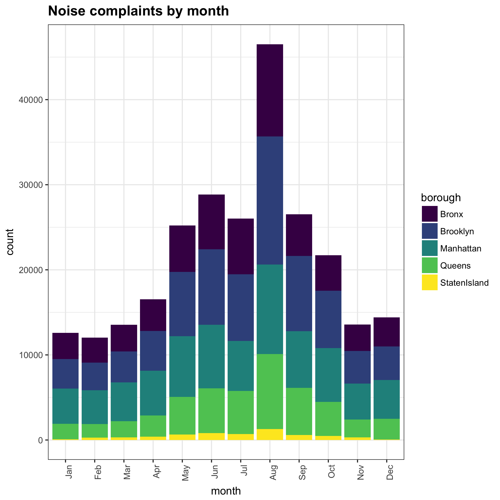
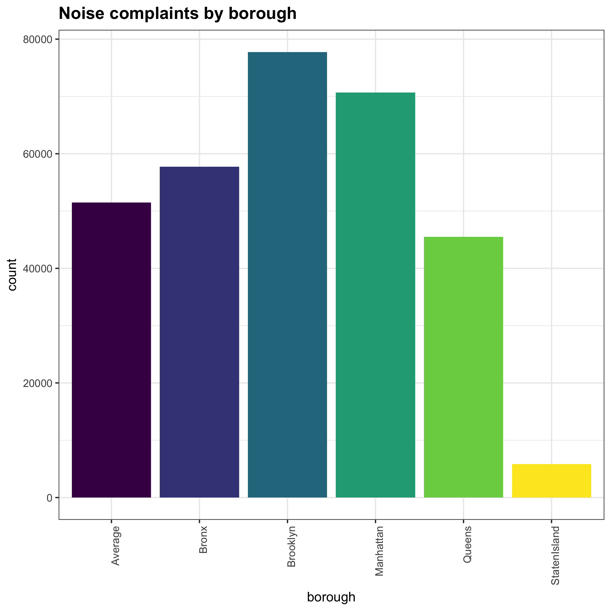

# NYC Noise Complaints 

## Live App URL

Live app is hosted [here](https://topspinj.shinyapps.io/nycnoise/).

## Overview

New York City has a booming nightlife scene. With a wide offering of sports bars, dive bars, cocktail dens, and bottle-service-only dance clubs,  there’s a reason why New York is called the "city that never sleeps". However, late-night parties affect residential areas and in some cases, the police get involved with noise complaints. 

This R Shiny app visualizes nightlife-related noise complaint acitvity across New York City's boroughs to help better understand when and where the nightclubs are affecting city residents. 

## Data source

This app uses 311* service request data from [NYC OpenData](https://data.cityofnewyork.us/), filtered for type "noise complaints" with descriptor "loud music/party". The key features of interest are: (1) date of noise complaint, (2) time noise complaint was issued, (3) time noise complaint was resolved, (4) latitude and longitude coordinates where noise complaint was made, and (5) borough (e.g., Manhattan, Queens, Staten Island, Long Island, Bronx). 

## When and where are noise complaints reported most?

Brooklyn clearly has the biggest nightlife, followed by Manhattan.

## Screenshots

